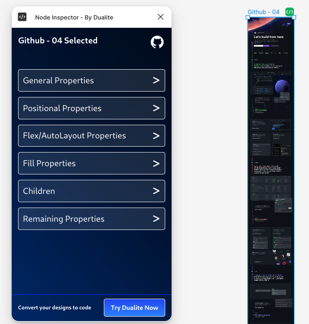

# Node Inspector - By Dualite

## Overview

Better Node Inspector is a powerful plugin designed to help developers inspect and analyze node properties in their projects. This tool provides a comprehensive view of various aspects of selected nodes, enhancing the development workflow.

## Features

Better Node Inspector offers a range of capabilities for examining node properties. Users can access general properties, positional attributes, manage flex and auto-layout settings, control fill properties, view child elements, and explore additional properties not covered in the main categories. This all-in-one interface streamlines the process of inspecting and node characteristics.

## Usage

Simply select a node in your project, and Better Node Inspector will display its properties in an easy-to-navigate interface.

## Integration

Node Inspector seamlessly integrates with Dualite, allowing you to convert your designs to code effortlessly.

## Installation

- Clone the repository
- Run `npm` to install dependencies
- Run `npm run dev` to start the development server for both plugin and UI.
- Plugin now supports hot reloading for both plugin and UI.
- Do not mess with the config files.

## Contributing Guidelines

We welcome contributions from the community! Here's how you can contribute to Node Inspector:

1. **Fork the Repository**: Start by forking the project repository to your GitHub account.

2. **Clone the Fork**: Clone your fork to your local machine for development.

3. **Create a Branch**: Make a new branch for your feature or bug fix.

4. **Make Changes**: Implement your changes, adhering to the existing code style and conventions.

5. **Test**: Ensure your changes don't break existing functionality and add tests for new features.

6. **Commit**: Make clear, concise commit messages describing your changes.

7. **Push**: Push your changes to your fork on GitHub.

8. **Pull Request**: Open a pull request from your fork to the main repository.

9. **Code Review**: Be open to feedback and make necessary adjustments.

For major changes, please open an issue first to discuss what you would like to change.
